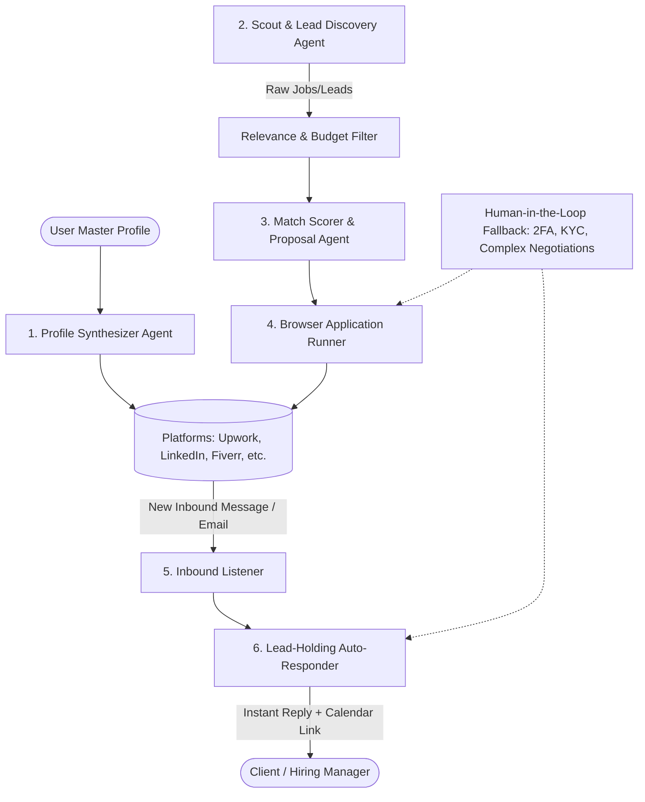

# AutoJob AI - System Architecture & Workflows

## 1. High-Level Architecture Overview

AutoJob AI is designed around a **modular multi-agent system** orchestrated through a central supervisor. Each agent handles a specialized phase of the freelance/remote job funnel:

---

## 2. Core Agents and Responsibilities

### A. Profile Synthesizer Agent (`src/agents/profile_agent.py`)
- **Input**: `config/profile.json` (user's skills, raw bio, past projects, certifications, target roles, desired rates).
- **Function**:
  - Dynamically rewrites and sizes profile components to fit platform constraints (e.g., Upwork 5000 char overview, LinkedIn 2600 char About section, Fiverr gig descriptions with strict keyword limits).
  - Generates platform-specific project portfolio entries and skill tags.
  - Automates browser form-filling to populate profiles across platforms.

### B. Scout & Job Scraper Agent (`src/agents/scout_agent.py`)
- **Function**:
  - Monitored channels: Remote job aggregators (RemoteOK, WeWorkRemotely, Wellfound), search feeds (LinkedIn job search, Upwork RSS/search), and social leads (Twitter/X developer searches, Reddit r/forhire).
  - Extracts: Job title, client budget/rate, required tech stack, company details, posting freshness.
  - Dedupes listings in local SQLite database (`data/autojob.db`).

### C. Match Scorer & Proposal Generator (`src/agents/proposal_agent.py`)
- **Function**:
  - Scores listings from 0 to 100 based on skill overlap, budget criteria, and client reputation.
  - Rejects low-match listings to prevent spamming and platform bans.
  - For top matches (e.g. score >= 80), crafts a hyper-personalized cover letter addressing the client's specific pain points and referencing relevant projects from the master profile.
  - Generates answers to screening questions (e.g., "How many years of experience do you have with Next.js?").

### D. Browser Automation Runner (`src/browser/runner.py`)
- **Function**:
  - Uses Playwright with a persistent browser profile (`userDataDir`).
  - Maintains authenticated sessions (cookies/local storage) so logins are preserved.
  - Implements human-like behavior: variable typing speeds, mouse movements, random delays.
  - **CAPTCHA & 2FA Handling**: Whenever a CAPTCHA or OTP prompt is detected, the runner triggers an audio/visual notification and pauses, allowing the user to solve it in the visible browser window before resuming.

### E. Lead-Holding Auto-Responder (`src/agents/responder_agent.py`)
- **Objective**: "Hold the client" immediately when they initiate contact.
- **Workflow**:
  1. Detects inbound message (on-platform chat or email notification).
  2. Analyzes client message intent:
     - Are they asking for portfolio links?
     - Are they asking for hourly rate or availability?
     - Are they inviting to an interview?
  3. Formulates a personalized, polite response:
     - Answers their immediate question accurately.
     - Confirms availability and interest.
     - Provides a direct link to book a 15-minute discovery call (e.g., Cal.com, Calendly).
  4. Alerts the user via desktop notification or Telegram/Discord webhook so the user can take over for final deal closing.

---

## 3. Data Schema & State Management

Local SQLite database (`data/autojob.db`) manages system state:

### Tables:
- **`jobs`**: `id`, `platform`, `external_id`, `title`, `url`, `company`, `budget`, `description`, `score`, `status` (`discovered`, `applied`, `rejected`, `interviewing`).
- **`applications`**: `id`, `job_id`, `proposal_text`, `applied_at`, `response_received`, `notes`.
- **`conversations`**: `id`, `platform`, `client_name`, `last_message_at`, `status` (`pending_reply`, `replied_by_bot`, `handed_to_human`).
- **`messages`**: `id`, `conversation_id`, `sender` (`client`/`bot`/`user`), `body`, `sent_at`.

---

## 4. Human-in-the-Loop (HITL) Gateways

To protect your accounts from bans, certain operations require human verification:
1. **Initial Platform Registration & KYC**: Government identity verification and phone OTPs.
2. **Contract / Payment Acceptance**: AutoJob does not sign legal contracts or accept escrow payments without human confirmation.
3. **Escalated Chat Negotiations**: If a client asks a complex custom question outside the pre-configured scope, the responder leaves a courteous holding note ("Let me check the exact details and get back to you shortly") and immediately notifies you.
